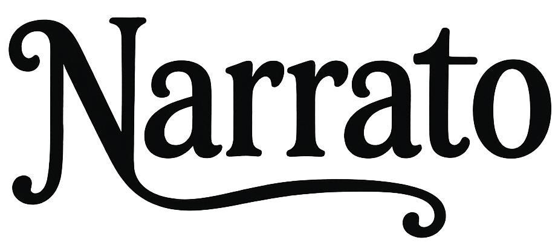

# Narrato: The AI-Powered Multimedia Storyteller

<p align="center">
  
</p>

<p align="center">
  <a href="https://narrato-9ab718a4ca8c.herokuapp.com/" target="_blank">
    
  </a>
  
  
  
</p>

**Narrato** is a magical web application that brings your ideas to life by automatically generating, illustrating, and narrating complete stories from a single prompt. Using a powerful pipeline of generative AI models, it creates a rich, multi-sensory storytelling experience.

> **Note:** The live demo is hosted on a free Heroku instance and may be slow or unavailable at times due to the intensive AI generation process.

## ✨ Features

-   **✍️ AI Story Generation:** Leverages Google's Gemini to write engaging and creative stories.
-   **🎨 AI-Powered Illustrations:** Generates beautiful, consistent images for each paragraph using a Hugging Face Space and a smart character analysis pipeline.
-   **🎤 AI-Powered Narration:** Converts the story text into high-quality audio narration with the Speechify API.
-   **🤖 Intelligent Consistency Pipeline:** A unique, multi-step AI process analyzes the story to create a "character database" and "style guide," ensuring visual consistency across all illustrations.
-   **🔐 User Authentication:** Secure, password-less login system using OTPs sent via email, powered by Shov.com.
-   **📚 Story Library:** Users can view their personal story history and browse public stories created by others.
-   **📤 PDF Export:** Export your favorite stories into a beautifully formatted PDF book, complete with illustrations.
-   **⚙️ Live Streaming Progress:** Story generation happens in a single, long-lived HTTP request, streaming progress directly to your browser in real-time using Server-Sent Events (SSE).

## 🛠️ Tech Stack

-   **Backend:** Python, Flask, Gunicorn
-   **Frontend:** HTML5, CSS3, JavaScript
-   **AI Services:** Google Gemini, Hugging Face, Speechify
-   **Database & Storage:** Shov.com (Key-Value DB), Cloudinary (Media Storage)
-   **Deployment:** Heroku

## 🚀 How It Works: The AI Pipeline

Narrato's magic lies in its state-of-the-art AI pipeline that ensures a high-quality, consistent output.

1.  **Prompt -> Story:** You provide a prompt. **Google Gemini** writes a complete story with a title, paragraphs, and a moral.
2.  **Story -> Analysis:** The application uses **Gemini** again to read the generated story and create two crucial documents:
    *   **Character Database:** Detailed descriptions of every character's appearance, clothing, and expressions.
    *   **Art Style Guide:** A consistent guide for color palette, lighting, and overall artistic style.
3.  **Analysis -> Image Prompts:** With the story, character database, and style guide, **Gemini** crafts highly detailed, consistent prompts for the image generation AI for *every single paragraph*.
4.  **Prompts -> Images:** The prompts are sent to a **Hugging Face Space** to generate illustrations. The results are stored in **Cloudinary**.
5.  **Text -> Audio:** The story's title and paragraphs are sent to the **Speechify API** to generate audio narration, which is also stored in **Cloudinary**.
6.  **Assembly:** The final story—with text, images, and audio—is assembled and saved to the user's history using **Shov.com**.

## 📂 Project Structure

The project is organized into the following main directories:

```
autoaistory/
├── narrato/
│   ├── core/              # Core application logic, decorators
│   ├── routes/            # Flask blueprints (auth, story, stream)
│   ├── services/          # Modules for interacting with external APIs
│   ├── static/            # Frontend assets (CSS, JS, images, fonts)
│   └── templates/         # HTML templates for the web interface
├── docs/                  # Project documentation
├── .env.example           # Example environment variables file
├── config.py              # Flask configuration settings
├── run.py                 # Main entry point to run the application
├── requirements.txt       # Python dependencies
└── Procfile               # Heroku process file
```

## 🏁 Getting Started

Follow these steps to run Narrato on your local machine.

### 1. Prerequisites

-   Python 3.9+
-   Git

### 2. Clone & Setup

```bash
# Clone the repository
git clone <your-repository-url>
cd autoaistory

# Create and activate a virtual environment
python -m venv venv
# On Windows: .\venv\Scripts\activate
# On macOS/Linux: source venv/bin/activate
```

### 3. Install Dependencies

```bash
pip install -r requirements.txt
```

### 4. Configure Environment Variables

Create a `.env` file by copying the `.env.example` file. Then, open the `.env` file and add your secret keys and configuration values. See `docs/environment.md` for more details.

```ini
# Flask Secret Key for Session Management
SECRET_KEY="a_very_strong_and_random_secret_key"

# Shov.com Database
SHOV_API_KEY="your_shov_api_key"
SHOV_PROJECT="your_shov_project_name"

# Google Gemini API Keys (add as many as you have, e.g., GOOGLE_API_KEY_2)
GOOGLE_API_KEY="your_google_gemini_api_key_1"

# Speechify API Keys
SPEECHIFY_KEY="your_speechify_api_key_1"

# Hugging Face for Image Generation (add as many as you have, e.g., HUGGING_FACE_TOKEN_2)
HUGGING_FACE_TOKEN="your_hugging_face_token_1"

# Cloudinary for Media Storage
CLOUDINARY_CLOUD_NAME="your_cloudinary_cloud_name"
CLOUDINARY_KEY="your_cloudinary_api_key"
CLOUDINARY_SECRET="your_cloudinary_api_secret"
```

### 5. Run the Application

```bash
python run.py
```

The application will be available at `http://127.0.0.1:8080`.

## ☁️ Deployment

This application is configured for deployment on Heroku. The `Procfile` defines the `web` process that serves the application using Gunicorn.

The application uses a **streaming architecture** and **does not require a separate worker process**. However, it is crucial to configure a long timeout (e.g., 3600 seconds) for the web server to handle the long-lived requests for story generation.

For detailed instructions, see the [Deployment Guide](./docs/deployment.md).

## 📄 License

This project is licensed under the MIT License.